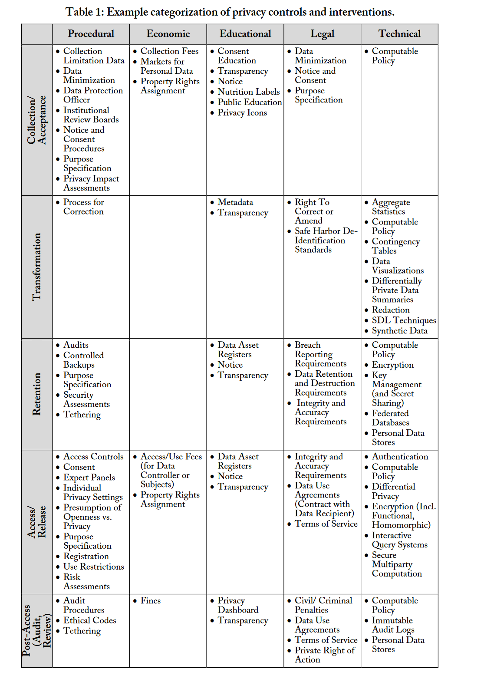

# Emerging Topics in Data Curation
**Author: Nic Weber, Sebastian Karcher** 

### Data Curation Future Directions
This final module discusses the future in data curation. Data curation is a fast moving field that responds to emerging needs of data producers, consumers, and users. Many emerging topics in data curation are beyond the scope of a 10 week quarter, but are worthy of our time and attention. Below, I cover some interesting topics and provide resources that you can use for future reference.

These are also not just my thoughts - [Nic asked friends and collaborators to tell me what emergent topics they thought were most important for the future of data curation](https://twitter.com/nniiicc/status/1266069650359500800?s=20). Below are their responses (which -- amusingly, include mine [Sebastian] and my own thoughts).

## Ontologies for Linked Data
In our previous chapter on linked data I described a rapidly evolving "cloud" or graph of linked data published to the web. Linked data are often governed by formal ontologies or vocabularies that include class, sub-class, properties and instances of data. These formalisms allow for data to follow a common markup (a standard), and these standards in turn enable relationships between data to be formally expressed and acted upon by machines.

The difference between a "vocabulary" and an "ontology" is often, ironically, semantic - ontologies are really just formal vocabularies that give linked data practitioners standard terms to define subjects, objects, and predicates for markup of data. As the [W3C notes](https://www.w3.org/standards/semanticweb/ontology):

> There is no clear division between what is referred to as “vocabularies” and “ontologies”. The trend is to use the word “ontology” for more complex, and possibly quite formal collection of terms, whereas “vocabulary” is used when such strict formalism is not necessarily used or only in a very loose sense. Vocabularies are the basic building blocks for inference techniques on the Semantic Web.

Even though I argued in our previous module that the semantic web has failed in many respects - where this field has succeeded is in providing useful ontologies for common data on the web. In the example I used for Austin, TX, the ontology that powered our linked data was `DbPedia`. By providing for standard ways to mark-up the subject, object, and predicates for Austin, TX, we were able to use simple declarations to query DbPedia to find the population of Austin, TX without having to explicitly state this factual information. In practice, this markup looked like the following:

```
<http://dbpedia.org/resource/Austin,_Texas>
<http://xmlns.com/foaf/0.1/based_near>
<http://sws.geonames.org/4671654/austin.html>
```

In terms of linked data - what we used were namespaces from the ontology that were defined on the web. If you click on the first namespace - you see all of what DbPedia knows about Austin, TX.

This allows for a plain language statement like "Austin has a population of 964,254" to take on a machine-readable statement like the following:

- Subject <http://dbpedia.org/resource/Austin,_Texas> 
- Predicate: dbo:PopulatedPlace/populationDensity 
- Object: 964,254

The key here is that DbPedia provided the subject and predicate statements - that is we used a `resource` in DbPedia to describe a particular place (Austin, TX) and we used a predicate from the ontology `dbo:PopulatedPlace/populationDensity` to connect the Subject to an Object (the actual population of Austin, TX). Our machines can interpret and know this semantic information simply through syntax. The ontology does all of the work in defining what a resource is, what a predicate means, and what the resulting object value is. 

Ontologies are rigid in that they require very specific syntax, but they are also incredibly powerful in that they provide for so much of the standardized factual information we expect (and know) to already exist on the web. DbPedia is just one node in the emerging linked data graph. By understanding and using ontologies of linked data, as we discussed last week, we can connect our data (however locally specific it may be) to this web of information. The key to really understanding and using ontologies effectively is to know which ones exist, and to master their syntax. 

This class has alluded a couple of times to the fact that one thing advancing linked data is an increased interest in, well, data, especially for machine learning and similar largely automated applications: that's why, e.g. the Croissant schema we looked at is a linked data schema and why Google pushed JSON-LD for dataset descriptions. This returns us to another theme that I have tried to emphasize over the last weeks of the course: data and their curation are political. Who organizes and provides access to data is ultimately a political question. Private corporations are massively investing in this area. At the same time, universities and governments are seeking to build public linked data resources. You can view Google's decentralized model of scraping data metadata from JSON-LD and DataCite's "Commons" (the name is not accidental!) and the "PID-graph" that underlies it, which relies on high quality metadata registered with DataCite, CrossRef, ORCID, etc. as antagonists in this struggle.

Back from the politics of this, here are some resources to continue exploring linked data and ontologies: 

- W3C [description of ontologies](https://www.w3.org/standards/semanticweb/ontology)
- Bennett, M., & Baclawski, K. (2017). The role of ontologies in linked data, big data and semantic web applications. Applied Ontology, 12(3-4), 189-194. This provides a critical but helpful overview of the role of ontologies in linked data. [PDF](https://content.iospress.com/download/applied-ontology/ao185?id=applied-ontology%2Fao185)
- Munir, K., & Anjum, M. S. (2018). The use of ontologies for effective knowledge modelling and information retrieval. Applied Computing and Informatics, 14(2), 116-126. [PDF](https://www.sciencedirect.com/science/article/pii/S2210832717300649)
- A handy [Linked Data Glossary](https://www.w3.org/TR/ld-glossary/)
- A very accessible and searchable list of [Linked Data Ontologies](https://lov.linkeddata.es/dataset/lov/vocabs)

## Sensitive Data & Privacy

The curation of data containing sensitive contents, including personally identifiable information (PII), is an emerging challenge for curators. As more personal data is collected there are increasingly valuable applications for responsibly using PII to generate valuable knowledge.  

The amount of collected and shared sensitive data is increasing dramatically: more sensitive data are getting collected and (e.g. due to data sharing mandates for researchers by governments) more such data are getting shared. At the same time, modern computational methods provide more and more sophisticated tools to unmask/re-identify individuals in sensitive datasets and many citizens (and research participants) are becoming more atuned to privacy concerns (and such concerns are increasingly codified in law such as the [GDPR](https://gdpr-info.eu/) in Europe or California's [Consumer Privacy Act](https://oag.ca.gov/privacy/ccpa))

### Methods for Protecting Sensitive Data
Protecting sensitive data is accordingly a quickly growing field with a wide range of research topics. One influential approach is the "[Five Safes](https://ukdataservice.ac.uk/help/secure-lab/what-is-the-five-safes-framework/)" framework pioneered by the UK Data archive.  Research data can be accessed safely when the following five conditions are in place:

  1. Safe data: data is treated to protect any confidentiality concerns.
  2. Safe projects: research projects are approved by data owners for the public good.
  3. Safe people: researchers are trained and authorised to use data safely.
  4. Safe settings: a SecureLab environment prevents unauthorised use.
  5. Safe outputs: screened and approved outputs that are non-disclosive.

But while a useful heuristic, this opens up as many questions as it raises: when are people safe? What makes a project safe/unsafe, how are can data be made safe(r), etc.? This massive table from a [2015 article by Micah Altman and colleagues](https://www.jstor.org/stable/26377584) both illustrates the complexity of the topic and is a helpful entry point into the topic of safe data. Rather than following the Five Safes, it distinguishes between the types of measure that can protect data (Procedural, economic, educational, legal, or technical) and the stage at which the protections are applied (at collection, at transformation, at retention/storage, at access/release, or post access/release). In total the table lists 84(!) different privacy controls. While there has been signficant progress on many of these over the last 10 years, the overall picture remains accurate. The complexity also means that privacy controls are poorly understood by researchers (let alone research participants). The complexity of establishing the right privacy protections and communicating those effectly to researchers and participants is one of the ongoing major challenges of data curation.



### Sensitive Data Case Study
- Census Data: The 2020 census was perhaps the latest in what are regular full surveys of the United States population. The census is key for accurate counts of people, their mobility, and for policymaking. The census is also a key source of demographic data about the USA- used broadly in social science, epidemiology, and legal scholarship. As such, access to reliable administrative micro-data (for example, responses household level census surveys) is critical for research and development. In the past, a network of census data centers was set up to provide access to the most restricted of these data sources. The 2020 census data will be the first to release sensitive data using a process of differential privacy - an encryption algorithm that obscures personally identifiable information but provides statistically sound micro-data to researchers. The 2020 census was also the largest and most sophisticated use of differential privacy to date. This will provide an incredible use case for how data curators might design, and effectively govern the release of sensitive data, and will likely result in many accessible tools and services for 2020 census data. 

You can learn a bit about the background and principles behind differential privacy in this excellent piece

- Nissim, K., Steinke, T., Wood, A., Altman, M., Bembenek, A., Bun, M., ... & Vadhan, S. (2017, June). Differential privacy: A primer for a non-technical audience. In Privacy Law Scholars Conf. https://privacytools.seas.harvard.edu/files/privacytools/files/pedagogical-document-dp_0.pdf

The decision to use differential privacy to protect census data was (and remains) highly controversial, though. Many demographers have [fiercely criticized the step](https://columbia.edu/~js5338/podcast/), arguing that it makes important types of analyses impossible and that its use isn't necessary.

## Emulation
Throughout the quarter we have discussed the transformation of data from closed or proprietary formats to open formats (or plain text encodings) which enable data to be reliably reused across different computing environments. There are typically two ways to achieve these transformations: Migration and Emulation. 

Migration is, quite simply, the reformatting of data - which depends upon moving content encoded in one standard to another (e.g. Excel to CSV).

In digital preservation an alternative approach to format migration is the practice of emulation. Emulation is, broadly, the reproduction of a computing environment in which a data format is rendered. This allows software or a program to be used in any hardware or computing environment.

Most of us have experienced emulation in the context of legacy video games. For example, when we play a version of ["Super Mario Bros" in a browser](https://supermarioemulator.com/mario.php) this is the emulation of the original Nintendo console. This allows us to port the functions of Nintendo to our contemporary computing hardware. We no longer need an actual Nintendo console to play the games that were originally developed for that hardware.

Similarly, emulation is being developed for interacting with and using software that is necessary for reproducing analyses, interacting with research artifacts (e.g. simulations or dynamic graphs), and rendering data. Emulation was once exceptionally difficult and prohibitively expensive to develop, but is being made easier by what are called "containers" or "virtual machines" that allow for anyone to reproduce a computing environment in which data were analyzed and used.

Examples and further reading on Emulation:

- Yale's Emulation as a Service https://web.library.yale.edu/emulation
- Code Ocean and the ability to "push a button" and rerun someone's analysis is a good example of emulation as a service for research data. What their [demo video](https://codeocean.com/webinar/editor) on the topic. There are several open source projects including "[Whole Tale](https://wholetale.org/)" and "[MyBinder](https://mybinder.org/)" that provide similar solutions, all based on containerization.
- Adam McMaster has a nice [general blog post on using containers for research](https://blog.zooniverse.org/2018/07/17/why-you-should-use-docker-in-your-research/).


## Artificial Intelligence

You knew we'd end on this -- everyone is talking about AI, and if you're working with and curating data, you neither can, nor should you ignore the breathtaking progress of the capabilities of Large Language Models (LLMs). 

The use cases for LLMs in data analytics are widespread and well-documented, ranging from helping to write data analysis code to supporting transcription and optical character recognicition to accurately classifying large amounts of qualitative data. But what are the prospects for data _curators_?

Without any claim to completeness, I'd point to at least three areas of promise and two massive challenges posed by the Rise of the Machines. 

### The Promise of AI

1. In his talk at UW earlier this semester (Spring 2024) Ted Underwood suggested that humanists had an active role to play in shaping the nature of AI by _curating_ specific datasets, both as data and as benchmark. This role for curation in shaping better (both more accurate and more ethical) AI has been a recurring theme, and Ted mentioned that openAI, for example, is actively hiring humanities PhD. Data curation (and data curators) are likely not going to be in a position to shape the substantive content of these datasets (i.e. establish what data scientists may refer to as a 'ground truth'), but they can play an important role in translating humanists'(and other subject specialists') understanding into structured data that can then be used to improve models.
2. LLMs can also be used to support curation. At least initially, this is going to be most important for uncurated repositories (like Figshare, Zenodo, or the Harvard Dataverse), where LLM-based tools can support researchers with little experience curating data. These tools could suggest better documentation, extract relevant information from data, or even flag disclosure risks. ICPSR and Dataverse have collaborated to implement a very early version of such a tool, "[Turbo Curator](https://www.iq.harvard.edu/news/revolutionizing-research-through-ai-powered-data-sharing-and-curation)" on the Harvard Dataverse. I briefly demo the tool in the lecture accompanying this text.
3. LLMs can also allow for simpler data _exploration_. Allowing for basic data exploration has long been a feature of data repositories. ICPSR, for example, has integrated [Survey Data and Analysis (SDA)](https://www.icpsr.umich.edu/web/pages/RCMD/tools/sda.html) with some datasets to allow users to obtain descriptive statistics and run basic regression analyses. Allowing, instead, exploration via LLM prompts to a given dataset (or a group of datasets) allows for more flexible exploration, can be done in ordinary language, and can be applied to types of data (e.g., qualitative data) not covered by the LLM tools. I demonstrate an early such tool as implemented in the Harvard Dataverse in this week's lecture.

### Challenges of AI for Curation

At the same time, most curators I know also  about the role LLMs can play in making curation harder, especially when it comes to curating sensitive data.  In a recent paper, a team from the MIT Libraries, led by the Director of Libraries, Chris Bourg, discusses (among many other issues) the [problems of privacy and LLM inputs](https://mit-genai.pubpub.org/pub/s793ca1i#open-research-questions-about-scholarly-communication-and-genai-inputs). 

1. LLMs do pose unknown risks to de-identification. One of the [earliest examples of using machine-learning](https://www.semanticscholar.org/paper/The-disputed-federalist-papers%3A-SVM-feature-via-Fung/85ee39f13f17db372b6cbadeedaed35724003816) (this 2003 paper references work as early as 1964(!) with similar results) approaches on text was used to establish authorship of some disputed Federalist papers (both data scientists and historians now concur James Madison likely wrote those). This also means, though, that we may be able to re-identify participants in qualitative studies purely based on speech patters found in the data (i.e., transcripts of interviews of focus groups); the quality of de-identification is unknown. Previous methods (such as the one used for the federalist papers) required careful set-up, a limited set of possible authors, and good 'training data' and wouldn't scale to endanger de-identification. LLMs can work with massively larger amounts of data and much less explicit training to produce good classification -- where 'classification' means, in our case, the correct identification of a speaker.

2. The second risk on LLMs is not inherent in their method but in their current roll-out, with all major LLM models (chatGPT, Claude, Gemini) controlled by major corporations. As interaction with LLM models turns into "Inputs", accidental data leaks are a significant concerns. To be specific, if researcher X uses chatGPT to analyze de-identified but sensitive data using chatGPT, that data and the interaction with the researcher may become part of the training set for the next generation of chatGPT (openAI does offer paid version of chatGPT that claim not to re-use any data from interactions). Even beyond re-identification risks, this use of participant data (as noted by Bourg et al.) is very likely not in alignment with the consent given by participants or their preferences for use of their data: in surveys of research participants, many are much more favorably inclined towards non-profit use of their data for research than towards their commercial use. What this means is, absent strong education and regulation, the use of LLMs by researchers to analyze human-participant data may pose a significant risk to both privacy and autonomy, the right of participants to decide what happens with their data. 

## Lecture
<iframe width="560" height="315" src="https://www.youtube.com/embed/oMM1xbg1GAo?si=HyCTFXtyl2g0kFUg" title="YouTube video player" frameborder="0" allow="accelerometer; autoplay; clipboard-write; encrypted-media; gyroscope; picture-in-picture; web-share" referrerpolicy="strict-origin-when-cross-origin" allowfullscreen></iframe>